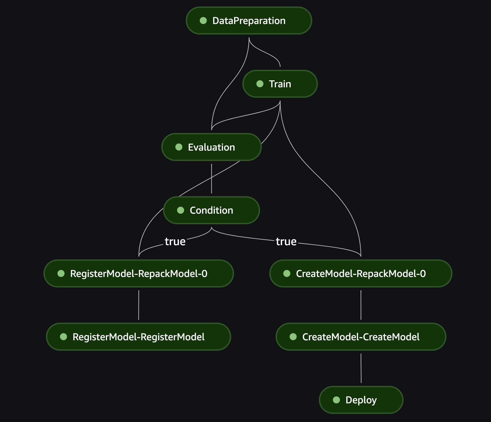

# ML Pipelines with AWS Cloud for NLP Tasks

## 1. Project Description
This project focuses on development of a Sagemaker Pipeline to train a NLP model for sentiment analysis of product reviews.

The dataset used is the Amazon product reviews dataset publicly available from the following S3 location: 

"s3://dlai-practical-data-science/data/raw/womens_clothing_ecommerce_reviews.csv"

The pipeline consists of the following steps:

1. Data Preparation (Processing): It read the raw data from an S3 location, processes the data and prepares trainig, test and validation datasets in the format of pytorch datasets and saves them on S3. It also creates and saves a vocabulary object which is used during the training and inference steps. 

2. Model Training: Using the training dataset, it then trains a NLP model by using LSTMs. It generates information about the training and validation set accuracy and loss during each epoch in addition to the model artifacts and information about the model structure. Finally it runs the trained model on the test set and generates a classification report. 

3. Model Evaluation: After training, an evaluation step is performed during which the accuracy of the model on the test set is calculated and is saved in a format readable by the sagemaker pipeline condition step. 

4. Checking Performance: The accuracy of the model on the test set is evaluated and if it is more than the predefined threshold, pipeline proceeds to the next steps, otherwise it stops. 

5. Model Creation and Registration: If the accuracy of the model is higher than the required threshold, a model package is prepared and is registered to Sagemaker Model Registry. Additionally, to allow for model deployment a model object is then created. 

6. Model Deployment: After the model is registered and a model object is created, it is deployed on a sagemaker serverless endpoint. The deployed model could then be invoked using HTTP requests and it expects JSON data as the input.

7. This is not part of the pipeline steps and the pipeline will finish after step 6 (deployment), however, another script is prepared for attaching a trigger to the pipeline for automatic triggering of the pipeline. After running the script, pipeline is triggered after new data is added to a specific location on S3 (potentially where the raw data is located)

## 2. Tech Stack
 - Python
 - Pytorch
 - AWS CLI
 - AWS Python SDK
 - Sagemaker Python SDK

## 3. How to run the project: 
Before running this project. please consider the following points: 
- Install the project packages using the main_requirements.txt file.
- Make sure you have AWS CLI installed on your machine.
- Create and populate a .env file in the root directory of the project. You can use the .env-sample file as a guide. This file is necessary for defining some environment variables which are required for running the project. 
- to run the pipeline, run the <b>main.py</b> script from within the root directory. 
<b>NOTE: you must run the main script from within the root directory, many of the scripts use relative paths which could lead to errors</b>

A list of the input parameters could be viewed in the main.py script.

## 4. Project File Struture:

- <b>main.py</b>: Defines and runs a pipeline, after the endpoint becomes available, runs a sample inference from the model as well. 

- <b>pipeline_step</b>: Includes different pipeline steps and low level scripts running in each step. 
    - <b>src</b>: Contains low level scripts that run in sagemaker containers in each step and some helper functions. The requirements.txt fiile in this folder is related to the deployment step and is not necessary for running the project on the local machine.

    - <b>steps scripts</b>: scripts defining each step. 

- <b>pipeline.py</b>: Could be used individually for defining and running the pipeline. 

- <b>setup_automatic_trigger.py</b>: A script for defining a trigger for the pipeline. Creates an EventBridge rule and attaches it to the pipeline. 

- <b>event_pattern.json</b>: The pattern JSON fiile used for creating an EventBridge trigger. 

- <b>.env-sample</b>: Expected environemnt variables. 

- <b>main_requirements.txt</b>:the main requirements file containing the required packages for using the project.    

